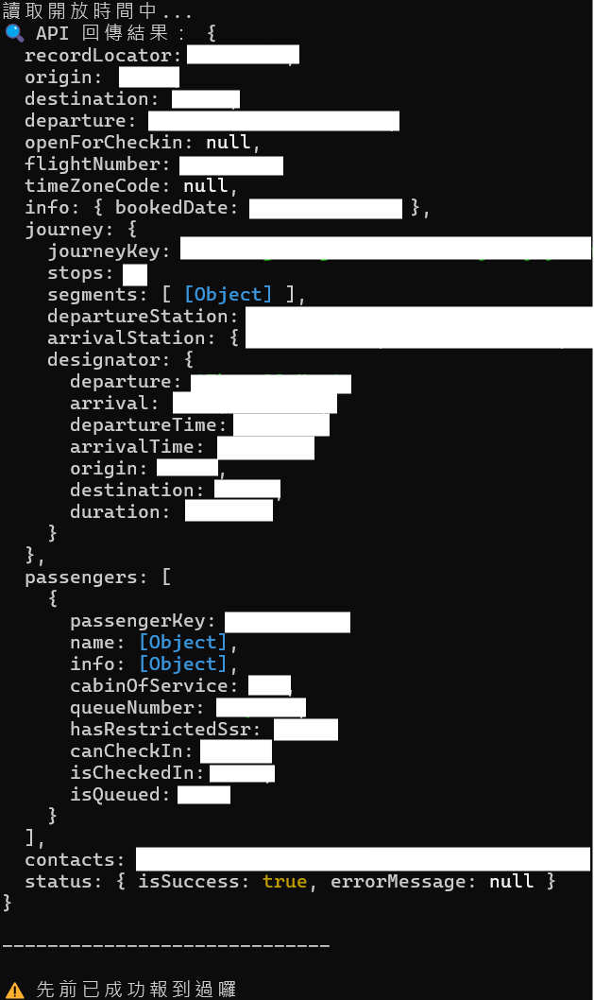
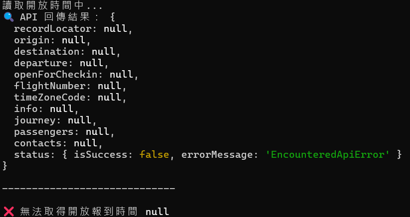

## 介紹
這是一個使用 JavaScript 撰寫的自動排程工具，主要目的是幫助使用者在特定時間點自動完成線上報到相關操作。
因為線上報到通常有固定的開放時間，而手動操作容易錯過黃金時機，這個工具嘗試透過自動化的方式來確保報到不會延誤。

## 功能特色
- 使用 .env 檔案管理敏感資訊與設定參數

- 依據 request 回傳取得的開放報到時間，再自動排程執行報到請求

- 可自行調整 retry 最大次數、retry 間隔時間

- 使用 node-schedule、node-fetch 及 luxon 來管理時間與處理網路請求

## 使用說明
- write .env (required)

- npm install

- execute (2 way)
   - npm start
   - open .bat

## 🖼️ 執行結果畫面

成功：  

錯誤：  

## 注意事項
請確保您擁有對該服務的合法使用權限

請勿濫用本工具造成服務過度負載

本工具僅供個人學習與自動化練習，請遵守服務條款
